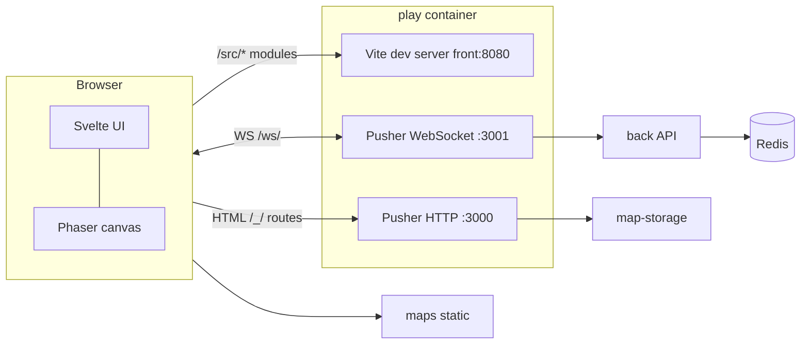

# WorkAdventure application development guide

This guide explains how the product is split across services, how changes flow through the stack, and how to **find, reuse, and extend** existing UI and logic. It complements the repo root [`AGENTS.md`](../../AGENTS.md) (commands and pitfalls), the [map scripting docs](../map-scripting/index.md), and the [**per-folder repo reference**](./repository-sections-guide.md) (what each top-level directory is for, and how to add new packages or services).

---

## 1. Mental model

WorkAdventure is not a single app: the **browser** talks to several backends, and the **play** service itself runs multiple processes in dev.

- **Svelte** owns overlays, menus, chat chrome, and layout; **Phaser** owns the world, avatars, and most in-world interaction.
- **Pusher** serves the play domain over HTTP (including templated `index.html`) and runs the **uWebSockets** server your client uses for real-time play.
- **back** authorizes rooms, groups, variables, and media strategies; it is the main game logic server behind the pusher socket layer.

---

## 2. Before you change code: build order and verification

Always respect this order when protos or shared types change:

1. **`messages/`** — `npm install` and `npm run ts-proto` (generates `ts-proto-generated` used everywhere).
2. **`play/`** — `npm run typesafe-i18n` before a production build or when adding keys.
3. Then typecheck/lint the service you touched (`play`, `back`, `map-storage`, …).

Typical checks:

| Area | Commands |
|------|----------|
| Play (TS + Svelte) | `cd play && npm run typecheck && npm run svelte-check` |
| Play tests | `cd play && npm test -- --watch=false` |
| Back | `cd back && npm run typecheck && npm test -- --watch=false` |
| E2E (Docker up) | `cd tests && npm run test-headed-chrome -- tests/<file>.ts` |

See [`AGENTS.md`](../../AGENTS.md) for memory flags, port conflicts, and Docker UI vs source (dev uses Vite + root `index.html` when `NODE_ENV` is not production).

---

## 3. Repository map (where each “side” lives)

| Concern | Primary paths |
|--------|----------------|
| **Browser UI (Svelte)** | `play/src/front/Components/`, `play/src/front/Chat/` |
| **Game world (Phaser)** | `play/src/front/Phaser/Game/`, `play/src/front/Phaser/Login/` |
| **Client state** | `play/src/front/Stores/` |
| **HTTP client / API helpers** | `play/src/front/Connection/`, `play/src/front/Api/` |
| **Pusher (HTTP + WS server)** | `play/src/pusher/` |
| **Room / game server** | `back/src/` (`GameRoom`, `Space`, `SocketManager`, …) |
| **Wire formats** | `messages/protos/`, generated code under `messages/` and `libs/messages` |
| **Map files & WAM** | `maps/`, map-storage service `map-storage/` |
| **Map scripts (iframe API)** | Scripts on maps; typings in `play/packages/iframe-api-typings/` |
| **Shared libraries** | `libs/` (e.g. `store-utils`, `map-editor`, shared messages) |

---

## 4. Play service: three faces

### 4.1 Vite + Svelte (what you see around the game)

- Entry: `play/index.html` → `/src/svelte.ts`.
- Root layout pieces:
  - **`App.svelte`** — mounts the game container and `GameOverlay`.
  - **`GameOverlay.svelte`** — **gate** for major modes: login, Woka selection, errors, then when the game is loaded: `ChatSidebar`, `MainLayout`, map editor, modals, etc.
  - **`MainLayout.svelte`** — action bar, picture-in-picture shell, popups, **`Menu`**, toasts, many feature flags driven by stores.

When adding a **global UI feature**, ask: *Does it belong on the overlay (full-screen flows), inside `MainLayout` (HUD), or only inside the game scene?* That choice determines file placement.

### 4.2 Phaser (canvas)

- **`GameManager`** and scenes under `play/src/front/Phaser/` coordinate lifecycle, room connection, and scenes.
- In-world entities (players, objects, scripted interactions) usually touch **both** Phaser code and **stores** that Svelte reads.

Prefer **stores** as the contract between Phaser and Svelte so UI stays reactive without tight coupling.

### 4.3 Pusher

- **`play/src/pusher/app.ts`** — Express app, static assets, controller registration.
- **`play/src/pusher/controllers/`** — HTTP routes (front HTML, auth callbacks, map proxies, etc.).
- **WebSocket** side pairs with the client connection layer in the front (see `IoSocketController` and front socket code).

Changes here affect **every** page served from the play host (caching, redirects, security headers indirectly via templates).

---

## 5. Using and editing existing Svelte components

### 5.1 How to find the right component

1. **Search UI strings** in `play/src/i18n/` (often `en-US/*.ts`) for the visible label, then find `$LL....` usage in `.svelte` files.
2. **Search `data-testid`** if tests or automation reference it (`grep` in `play/src/front`).
3. **Trace from `MainLayout` / `GameOverlay`** — most shell UI is mounted from these two trees.
4. **Menu and settings** — `play/src/front/Components/Menu/` (`Menu.svelte` switches submenus by `SubMenusInterface` keys from `MenuStore`).

### 5.2 Patterns to follow

- **Stores** (`play/src/front/Stores/*.ts`): use for cross-component state (visibility, current user, room URL). Subscribe in Svelte with `$store` or `.subscribe`.
- **Tailwind + existing classes**: match spacing, `pointer-events-*`, and z-index conventions near sibling components (`MainLayout` comments document ordering concerns).
- **Lazy loading**: heavy pieces use dynamic `import()` (see `Menu.svelte` and `Lazy` in `MainLayout`).
- **Accessibility**: prefer native buttons/labels; if you add controls, mirror patterns from sibling menus (keyboard, `Escape` to close).

### 5.3 Adding a settings submenu (example workflow)

1. Add a **`SubMenusInterface`** key and wire translations in `play/src/i18n/*/menu.ts`.
2. Register the menu item and visibility in **`MenuStore`** (and any capability gating).
3. Add a **`.svelte`** submenu under `Components/Menu/` and a `switch` branch in **`Menu.svelte`**.
4. Run **`npm run typesafe-i18n`** and **`npm run i18n:diff`** for other locales if required.

### 5.4 Adding UI that depends on game state

1. Update or create a **store** in `Stores/`.
2. Update **Phaser** code (or connection handlers) to `set` store values when game events fire.
3. Mount UI under **`GameOverlay`** or **`MainLayout`** guarded by `{#if $yourStore}`.

This keeps Phaser from importing Svelte and avoids circular dependencies.

---

## 6. Back end (`back/`)

- **`back/src/server.ts` / `App.ts`** — HTTP and wiring.
- **`RoomManager`**, **`GameRoom`**, **`Space`**, **`User`** — room lifecycle and occupants.
- **`SocketManager`** and **`Model/Websocket/`** — message handling; types often come from **messages** protos.
- **Redis** repositories — variables and player state persistence when enabled.

When you change a **protocol** or message shape, update **`.proto` files**, regenerate **messages**, then fix **back** and **play** consumers together.

---

## 7. Messages and shared types

- Source of truth: **`messages/protos/*.proto`**.
- Regenerate: `cd messages && npm run ts-proto`.
- Downstream packages import generated modules (paths vary; follow existing imports in `back` and `play`).

Never hand-edit generated files under generated trees.

---

## 8. Maps, map-storage, and the iframe API

- **Maps** live under `maps/` and are served as static assets in dev (`maps.workadventure.localhost`).
- **map-storage** persists and serves map data for the inline editor and related flows.
- **Map scripts** use the **iframe / scripting API**; public docs live under [`docs/developer/map-scripting/`](../map-scripting/index.md).

Product features that only affect **map authoring** or **scripts** may not need `play` or `back` changes; features that affect **core client behavior** usually need `play` and sometimes protos/back.

---

## 9. Libraries (`libs/`)

Shared packages reduce duplication:

- **`libs/messages`** — generated / shared message types and helpers.
- **`libs/map-editor`**, **`libs/store-utils`**, etc. — editor and shared client utilities.

If two services need the same pure logic, prefer **`libs/`** over copy-paste.

---

## 10. Configuration and environment

- **`.env.template`** — reference for Docker Compose and local dev.
- Service-specific **validators** (e.g. `play/src/pusher/enums/EnvironmentVariable.ts`, `back/src/Enum/EnvironmentVariable.ts`) document what each variable does.

After adding an env var, update **template**, **compose** (if needed), and **validators** so failures are explicit.

---

## 11. Testing strategy

- **Unit / component tests** — `play` (Vitest), `back` (Vitest), etc.; see each package’s `package.json`.
- **E2E** — `tests/` with Playwright; requires full Docker stack.
- **Manual** — `play.workadventure.localhost` with maps URL; allow **cold start** after `docker compose restart play` (pusher may take a minute to listen).

---

## 12. Checklist for a typical feature

1. **Scope**: UI only, client + pusher, client + back + proto, or map/script only?
2. **Types**: Do protos or shared DTOs change? If yes → **messages first**.
3. **Strings**: New copy → **i18n** (`play/src/i18n`) + `typesafe-i18n`.
4. **State**: New cross-cutting state → **store** + minimal Phaser/API touch points.
5. **Verify**: `typecheck`, `svelte-check` for play, tests for touched packages, smoke in browser.

---

## 13. Further reading

- [`repository-sections-guide.md`](./repository-sections-guide.md) — each repo area (`play`, `back`, `libs`, `maps`, …), edit vs create workflows.
- [`AGENTS.md`](../../AGENTS.md) — commands, build order, common failures.
- [`docs/others/contributing/communication-between-services.md`](../others/contributing/communication-between-services.md) — how services talk.
- [`docs/developer/map-scripting/`](../map-scripting/index.md) — map-side scripting and API surface.
- [`docs/others/self-hosting/env-variables.md`](../others/self-hosting/env-variables.md) — deployment configuration.

---

*This guide is maintained for contributors working in the open-source tree; hosted SaaS may differ in deployment details while sharing the same codebase layout.*
