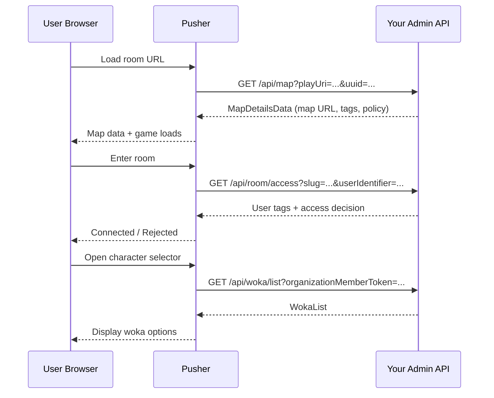
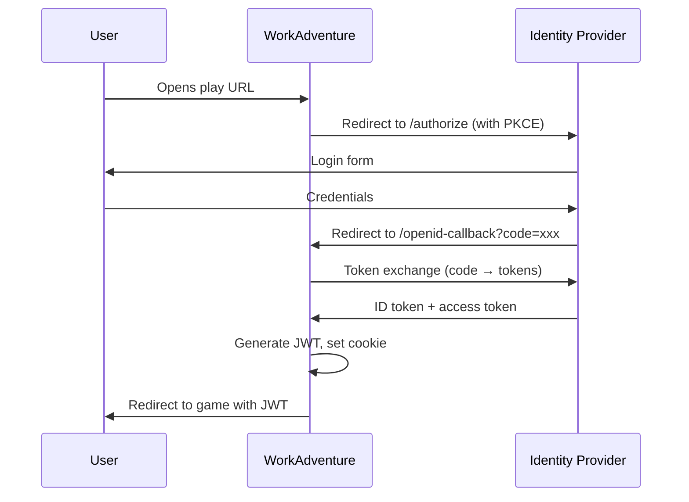
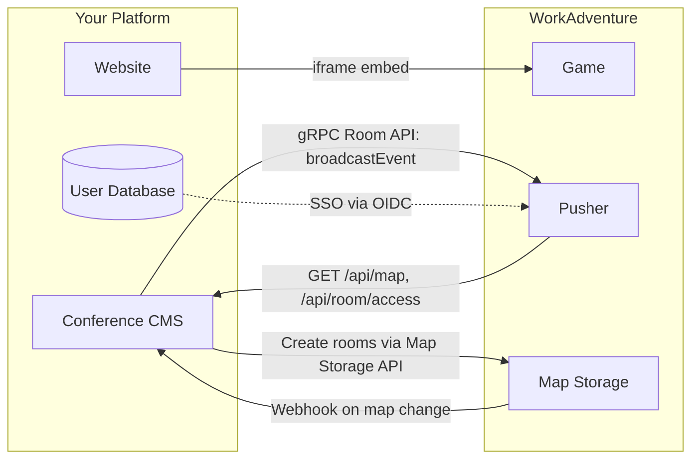
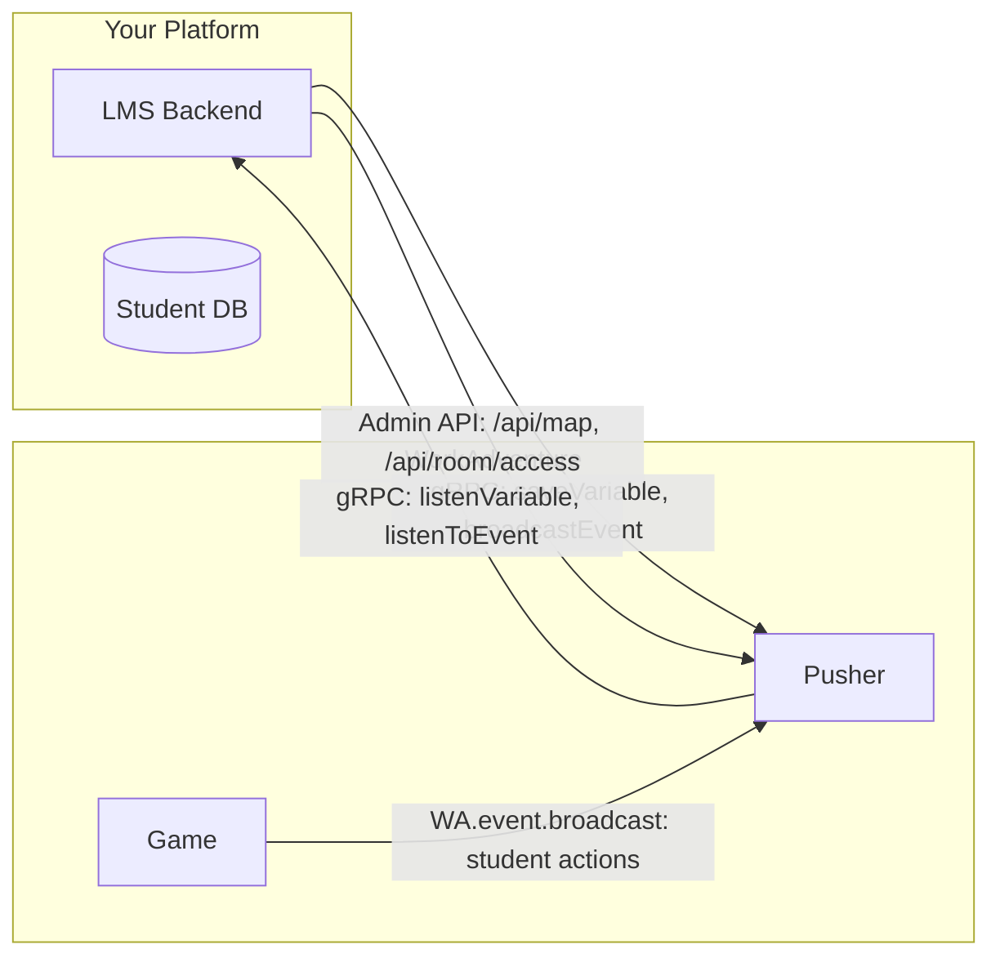

# External Integration & Embedding Guide

A comprehensive guide to embedding WorkAdventure into your application and integrating WorkAdventure with external systems. This document covers every integration surface WorkAdventure exposes, with architecture diagrams, code examples, and decision guides to help you pick the right approach.

**For implementation patterns, working code examples, and agentic development best practices**, see the companion document: [Embedding & Integration Best Practices for Agentic Development](./embedding-integration-best-practices.md).

---

## Table of Contents

- [Architecture Overview](#architecture-overview)
- [Integration Methods at a Glance](#integration-methods-at-a-glance)
- [Method 1 — Embedding WorkAdventure in an iframe](#method-1--embedding-workadventure-in-an-iframe)
- [Method 2 — Embedding External Apps Inside WorkAdventure](#method-2--embedding-external-apps-inside-workadventure)
- [Method 3 — Scripting API (`WA` Object)](#method-3--scripting-api-wa-object)
- [Method 4 — Room API (gRPC)](#method-4--room-api-grpc)
- [Method 5 — Admin REST Endpoints (Pusher)](#method-5--admin-rest-endpoints-pusher)
- [Method 6 — Map Storage REST API](#method-6--map-storage-rest-api)
- [Method 7 — Admin API (Your Backend)](#method-7--admin-api-your-backend)
- [Method 8 — Webhooks](#method-8--webhooks)
- [Method 9 — SSO / OpenID Connect](#method-9--sso--openid-connect)
- [Method 10 — WebSocket Real-Time](#method-10--websocket-real-time)
- [Decision Matrix](#decision-matrix)
- [Common Integration Patterns](#common-integration-patterns)
- [Security Considerations](#security-considerations)
- [Environment Variables Reference](#environment-variables-reference)

---

## Architecture Overview

```
┌──────────────────────────────────────────────────────────────────────┐
│  Your External Application                                          │
│  ┌──────────┐  ┌──────────────┐  ┌────────────────┐                 │
│  │ iframe   │  │  REST Client │  │  gRPC Client   │                 │
│  │ (embed)  │  │  (Admin API) │  │  (Room API)    │                 │
│  └────┬─────┘  └──────┬───────┘  └───────┬────────┘                 │
└───────┼───────────────┼──────────────────┼───────────────────────────┘
        │               │                  │
        ▼               ▼                  ▼
┌──────────────────────────────────────────────────────────────────────┐
│  WorkAdventure                                                       │
│                                                                      │
│  ┌──────────────────────────────┐  ┌───────────────────────────────┐ │
│  │ Play / Pusher (port 3000/1)  │  │ Map Storage (port 3000)       │ │
│  │                              │  │                               │ │
│  │  ┌─────────────────────┐     │  │  REST API:                    │ │
│  │  │ Game (Phaser/Svelte)│     │  │   POST /upload                │ │
│  │  │  ↕ iframe_api.js    │     │  │   PUT  /*                     │ │
│  │  └─────────────────────┘     │  │   GET  /download              │ │
│  │  ↕ WebSocket (/ws/)         │  │   DELETE /*                   │ │
│  │                              │  │  Webhooks (on map change)     │ │
│  │  REST API:                   │  └───────────────────────────────┘ │
│  │   GET  /map                  │                                    │
│  │   POST /room/refresh         │  ┌───────────────────────────────┐ │
│  │   POST /message              │  │ Room API (gRPC port 50051)    │ │
│  │   POST /global/event         │  │                               │ │
│  │   GET  /rooms                │  │  readVariable / listenVariable│ │
│  │   ...                        │  │  saveVariable                 │ │
│  └──────────┬───────────────────┘  │  broadcastEvent / listenEvent │ │
│             │                       └───────────────────────────────┘ │
│             ▼                                                         │
│  ┌──────────────────────┐    ┌────────────────┐                      │
│  │ Back (port 8080)     │    │ Admin API      │                      │
│  │ Room state, events,  │    │ (YOUR backend) │                      │
│  │ variables (Redis)    │    │ Auth, maps,    │                      │
│  └──────────────────────┘    │ woka lists     │                      │
│                              └────────────────┘                      │
│  ┌──────────────────────────────────────────────┐                    │
│  │ Traefik (reverse proxy / routing)            │                    │
│  └──────────────────────────────────────────────┘                    │
└──────────────────────────────────────────────────────────────────────┘
```

---

## Integration Methods at a Glance

| # | Method | Direction | Protocol | Best For |
|---|--------|-----------|----------|----------|
| 1 | Embed WA in iframe | Your app ← WA | HTTP/iframe | Adding WA as a feature in your web app |
| 2 | Embed app in WA | WA ← Your app | iframe + `WA` API | Adding your app as a feature inside WA |
| 3 | Scripting API | WA ← Script | postMessage | Map-level automation, NPCs, UI overlays |
| 4 | Room API | External → WA | gRPC | Backend-to-backend state & events |
| 5 | Admin REST (Pusher) | External → WA | HTTPS REST | Room management, broadcasts, monitoring |
| 6 | Map Storage REST | External → WA | HTTPS REST | CRUD on maps, file uploads |
| 7 | Admin API | WA → Your backend | HTTPS REST | Auth, access control, user management |
| 8 | Webhooks | WA → Your backend | HTTPS POST | React to map changes |
| 9 | SSO / OpenID | WA ↔ IdP | OAuth2/OIDC | Corporate authentication |
| 10 | WebSocket | Browser ↔ WA | WS + protobuf | Custom real-time features |

---

## Method 1 — Embedding WorkAdventure in an iframe

The simplest way to add WorkAdventure to an existing web application is to embed it in an iframe.

### Basic Embedding

```html
<iframe
  src="https://play.workadventure.localhost/_/global/maps.workadventure.localhost/starter/map.json"
  width="100%"
  height="600"
  allow="microphone; camera; fullscreen; autoplay; display-capture"
  style="border: none;"
></iframe>
```

### Required `allow` Attributes

WorkAdventure needs access to several browser APIs. Add all that apply to your use case:

| Attribute | Purpose |
|-----------|---------|
| `microphone` | Voice chat |
| `camera` | Video chat |
| `fullscreen` | Fullscreen mode |
| `autoplay` | Media playback |
| `display-capture` | Screen sharing |

### Passing Parameters via URL

You can pass data to WorkAdventure through the URL:

```
https://play.example.com/_/global/maps.example.com/map.json#start-layer-name
```

- **Hash fragment** — Sets the entry point (layer name) where the user spawns
- **`token` query param** — Pre-authenticates a user with a JWT (useful after your own login flow)
- **`playUri` query param** — Overrides the map URL the user connects to

### Single-Domain Deployment

For production, use the single-domain Docker Compose setup (`docker-compose.single-domain.yaml`). This routes all services through one domain with path prefixes, avoiding cross-origin issues:

```
https://play.example.com/           → Play frontend
https://play.example.com/api/       → Back service
https://play.example.com/map-storage/ → Map storage
https://play.example.com/uploader/  → Uploader
```

### Communicating From Parent to WorkAdventure

If you need bidirectional communication between your parent app and the embedded WorkAdventure, combine iframe embedding with **Method 3 (Scripting API)**. Use `WA.state` variables or `WA.event` from inside a map script, and have your parent page listen to `window.postMessage` events.

---

## Method 2 — Embedding External Apps Inside WorkAdventure

WorkAdventure provides several mechanisms to embed your external application inside the game world.

### 2a. Co-Websites (Side Panel)

Co-websites open in a panel on the right side of the screen. This is ideal for tools, forms, dashboards, and document editors.

**Via map properties (Tiled):**
1. Create a rectangle object on an object layer
2. Add property `openWebsite` = `https://your-app.example.com`
3. Add property `openWebsiteAllowApi` = `true` (to enable the `WA` scripting API)

**Via scripting API:**
```javascript
// Open a co-website with API access
const coWebsite = await WA.nav.openCoWebSite(
  "https://your-app.example.com",  // URL
  true,                             // allowApi - enables WA object
  "",                               // allowPolicy - iframe allow attribute
  50,                               // widthPercent - panel width
  0,                                // position - slot index
  true,                             // closable - user can close it
  false                              // lazy - load immediately
);

// Close it later
coWebsite.close();
```

### 2b. Embedded Websites (In-World)

Websites that appear directly in the game world at specific map positions, as if they were a poster or screen on a wall.

**Via map properties (Tiled):**
1. Create a rectangle object on an object layer
2. Add property `openWebsite` = `https://your-app.example.com`
3. The website renders at the rectangle's position in-world

**Via scripting API (dynamic):**
```javascript
const website = await WA.room.website.create({
  name: "my-embedded-site",
  url: "https://your-app.example.com",
  position: {
    x: 100,
    y: 200,
    width: 200,
    height: 150,
  },
  allowApi: true,
  allow: "microphone; camera",
});

// Update later
await WA.room.website.modify("my-embedded-site", {
  url: "https://your-app.example.com/page2",
});

// Delete
await WA.room.website.delete("my-embedded-site");
```

### 2c. UI Websites (Floating Overlays)

Floating HTML panels positioned anywhere on screen, outside the game world. Ideal for HUD elements, notifications, scoreboards, or mini-apps.

```javascript
const uiWebsite = await WA.ui.website.create({
  name: "my-overlay",
  url: "https://your-app.example.com/widget",
  position: {
    vertical: "middle",
    horizontal: "middle",
  },
  size: {
    width: 400,
    height: 300,
  },
  margin: { top: 50 },
  allowApi: true,
  allow: "",
});
```

### 2d. Custom Menu Items

Add a link to your app in WorkAdventure's main navigation menu:

```javascript
const menu = WA.ui.registerMenuCommand("My App", {
  iframe: "https://your-app.example.com",
  allowApi: true,
});

// Remove later
menu.remove();
```

### Using the `WA` API Inside Your Embedded App

Any embedded iframe (co-website, embedded website, UI website) that has `allowApi: true` can use the full `WA` scripting API:

```html
<!-- your-app.example.com/page.html -->
<!doctype html>
<html>
<head>
  <script src="https://play.workadventure.localhost/iframe_api.js"></script>
</head>
<body>
  <script>
    WA.onInit().then(() => {
      // Read who the current user is
      console.log(WA.player.name);
      console.log(WA.player.tags);

      // Listen for room state changes
      WA.state.onVariableChange("myVar").subscribe((val) => {
        console.log("Variable changed:", val);
      });

      // Send a chat message back to the game
      WA.chat.sendChatMessage("Hello from my app!", "My App");

      // Listen for custom events
      WA.event.on("my-event").subscribe((evt) => {
        console.log("Event received:", evt.data);
      });

      // Broadcast an event to all players
      WA.event.broadcast("from-external-app", { action: "refresh" });
    });
  </script>
</body>
</html>
```

---

## Method 3 — Scripting API (`WA` Object)

The scripting API is the richest integration surface. Scripts run inside WorkAdventure and can control almost every aspect of the game.

### Loading a Script

**Option A — Map property:** Set the `script` property on your map to a `.js`, `.ts`, or `.html` URL.

**Option B — iframe with `openWebsiteAllowApi: true`:** See Method 2.

### API Namespaces

| Namespace | Purpose | Key Methods |
|-----------|---------|-------------|
| `WA.nav` | Navigation | `openTab`, `goToRoom`, `openCoWebSite`, `goToLogin` |
| `WA.chat` | Chat | `sendChatMessage`, `onChatMessage`, `open`, `close` |
| `WA.ui` | UI overlays | `openPopup`, `registerMenuCommand`, `website.create`, `actionBar`, `banner` |
| `WA.room` | Map control | `showLayer`, `hideLayer`, `setProperty`, `onEnterLayer`, `website` |
| `WA.state` | Shared room state | `saveVariable`, `loadVariable`, `onVariableChange` |
| `WA.player` | Current user | `name`, `tags`, `position`, `state` |
| `WA.players` | Other users | `onEnter`, `onLeave`, `onVariableChange` |
| `WA.event` | Custom events | `broadcast`, `on` |
| `WA.camera` | Camera control | `set`, `follow`, `stopFollowing` |
| `WA.sound` | Audio | `loadSound`, `play` |
| `WA.controls` | Player controls | `disable`, `restore` |
| `WA.spaces` | Cross-room spaces | `joinSpace` |
| `WA.mapEditor` | Map editing | Integrate with the map editor |

### Key Integration Patterns with the Scripting API

#### Pattern: Share State Between Your App and Players

```javascript
// In your map script
WA.onInit().then(() => {
  // Save a variable that all players and external systems can read
  await WA.state.saveVariable("pollResults", { yes: 12, no: 5 });

  // React to changes from any player or external system
  WA.state.onVariableChange("pollResults").subscribe((results) => {
    updateUI(results);
  });
});
```

#### Pattern: Custom Events Between Players and External Apps

```javascript
// Broadcast to all players in the room
await WA.event.broadcast("notification", {
  type: "alert",
  message: "Meeting starts in 5 minutes!",
});

// Listen for events (from other players or from the Room API gRPC)
WA.event.on("notification").subscribe((evt) => {
  console.log(evt.data);
});
```

#### Pattern: Player Tracking

```javascript
// Know when a player enters your zone
WA.room.onEnterLayer("meetingZone").subscribe(() => {
  WA.event.broadcast("player-entered-zone", {
    player: WA.player.name,
    zone: "meetingZone",
  });
});

// Track other players
WA.players.onEnter((player) => {
  console.log(`${player.name} joined with tags:`, player.tags);
});
```

---

## Method 4 — Room API (gRPC)

The Room API is a **server-to-server** gRPC interface that lets your backend services read and write room state and events in real time. This is the recommended way to integrate backend systems.

### Configuration

Enable the Room API by setting these environment variables:

```env
ROOM_API_ENABLED=true
ROOM_API_SECRET_KEY=your-secret-key
```

The API is available at `room-api.workadventure.localhost:50051` (or on a custom domain via Traefik routing).

### Protocol Definition

```protobuf
// messages/protos/room-api.proto
service RoomApi {
    rpc readVariable(VariableRequest) returns (google.protobuf.Value);
    rpc listenVariable(VariableRequest) returns (stream google.protobuf.Value);
    rpc saveVariable(SaveVariableRequest) returns (google.protobuf.Empty);
    rpc broadcastEvent(DispatchEventRequest) returns (google.protobuf.Empty);
    rpc listenToEvent(EventRequest) returns (stream EventResponse);
}
```

### Authentication

All gRPC calls must include a `secretKey` metadata field matching `ROOM_API_SECRET_KEY`:

```python
# Python example
import grpc
from room_api_pb2 import VariableRequest, SaveVariableRequest, DispatchEventRequest, EventRequest
from room_api_pb2_grpc import RoomApiStub

channel = grpc.insecure_channel('room-api.example.com:50051')
metadata = [('secretKey', 'your-secret-key')]
stub = RoomApiStub(channel)
```

### Examples

#### Read and Write Room Variables

```python
# Read a variable
response = stub.readVariable(
    VariableRequest(room="/_/global/maps.example.com/map.json", name="pollResults"),
    metadata=metadata
)
print(response.value)  # {"yes": 12, "no": 5}

# Write a variable (synced to all players in real time)
stub.saveVariable(
    SaveVariableRequest(
        room="/_/global/maps.example.com/map.json",
        name="pollResults",
        value={"yes": 15, "no": 5}
    ),
    metadata=metadata
)
```

#### Stream Variable Changes

```python
# Server-side stream — receives updates in real time
for value in stub.listenVariable(
    VariableRequest(room="/_/global/maps.example.com/map.json", name="pollResults"),
    metadata=metadata
):
    print("Poll results updated:", value)
```

#### Broadcast Events to Players

```python
# Send an event to all players in a room
stub.broadcastEvent(
    DispatchEventRequest(
        room="/_/global/maps.example.com/map.json",
        name="notification",
        data={"type": "alert", "message": "System maintenance in 10 minutes"}
    ),
    metadata=metadata
)

# Send to specific players only
stub.broadcastEvent(
    DispatchEventRequest(
        room="/_/global/maps.example.com/map.json",
        name="private-message",
        data={"text": "You won a prize!"},
        targetUserIds=[42, 87]
    ),
    metadata=metadata
)
```

#### Listen to Events From Players

```python
# Server-side stream — receives events broadcast by players via WA.event.broadcast()
for event in stub.listenToEvent(
    EventRequest(room="/_/global/maps.example.com/map.json", name="chat-command"),
    metadata=metadata
):
    print(f"User {event.senderId} sent: {event.data}")
```

### Use Cases

- Push real-time notifications from your backend to players
- Sync game state with an external database or CMS
- Build a moderation dashboard that monitors room events
- Trigger game actions from external systems (CI/CD, webhooks, IoT)
- Implement server-side game logic (polls, quizzes, auctions)

---

## Method 5 — Admin REST Endpoints (Pusher)

The pusher service exposes admin REST endpoints for room management, broadcasting, and monitoring. All admin endpoints require the `admin-token` header.

### Configuration

Set the admin token in your environment:

```env
ADMIN_API_TOKEN=your-admin-token
```

### Endpoints

#### List All Rooms

```bash
curl -H "admin-token: your-admin-token" \
  https://play.example.com/rooms
```

Response: Array of room objects with user counts.

#### Refresh / Kick Users from a Room

```bash
curl -X POST \
  -H "admin-token: your-admin-token" \
  -H "Content-Type: application/json" \
  -d '{"playUri": "/_/global/maps.example.com/map.json"}' \
  https://play.example.com/room/refresh
```

#### Broadcast a Message to a Room

```bash
curl -X POST \
  -H "admin-token: your-admin-token" \
  -H "Content-Type: application/json" \
  -d '{
    "playUri": "/_/global/maps.example.com/map.json",
    "type": "ban",
    "message": "Server restarting in 5 minutes"
  }' \
  https://play.example.com/message
```

#### Send a Global Event to All Rooms

```bash
curl -X POST \
  -H "admin-token: your-admin-token" \
  -H "Content-Type: application/json" \
  -d '{
    "name": "notification",
    "data": {"message": "Welcome to the conference!"},
    "type": "event"
  }' \
  https://play.example.com/global/event
```

#### Send an Event to a Specific Module

```bash
curl -X POST \
  -H "admin-token: your-admin-token" \
  -H "Content-Type: application/json" \
  -d '{
    "playUri": "/_/global/maps.example.com/map.json",
    "moduleName": "my-module",
    "type": "event",
    "data": {"action": "refresh"}
  }' \
  https://play.example.com/external-module/event
```

#### Health Check

```bash
curl https://play.example.com/ping
curl -H "admin-token: your-admin-token" https://play.example.com/ping-backs
```

---

## Method 6 — Map Storage REST API

The map storage service provides a full CRUD API for managing map files and assets.

### Authentication

Map storage supports multiple authentication strategies (configure via environment variables):

| Strategy | Env Vars |
|----------|----------|
| Bearer token | `ENABLE_BEARER_AUTHENTICATION=true`, `AUTHENTICATION_TOKEN=xxx` |
| Basic auth | `ENABLE_BASIC_AUTHENTICATION=true`, `AUTHENTICATION_USERNAME` / `AUTHENTICATION_PASSWORD` |
| Digest auth | `ENABLE_DIGEST_AUTHENTICATION=true`, `AUTHENTICATION_USERNAME` / `AUTHENTICATION_PASSWORD` |
| Remote validation | `AUTHENTICATION_VALIDATOR_URL=https://your-validator/auth` |

### Endpoints

```bash
# Upload a ZIP of map files
curl -X POST -H "Authorization: Bearer TOKEN" \
  -F "file=@my-map.zip" \
  https://map-storage.example.com/upload

# Create or overwrite a single file
curl -X PUT -H "Authorization: Bearer TOKEN" \
  -H "Content-Type: application/json" \
  -d '{"test": true}' \
  https://map-storage.example.com/path/to/file.wam

# JSON Patch a WAM file
curl -X PATCH -H "Authorization: Bearer TOKEN" \
  -H "Content-Type: application/json" \
  -d '[{"op": "replace", "path": "/layers/0/name", "value": "new-name"}]' \
  https://map-storage.example.com/path/to/map.wam

# Download a directory as ZIP
curl -H "Authorization: Bearer TOKEN" \
  https://map-storage.example.com/download?path=/my-maps/

# Delete a file or directory
curl -X DELETE -H "Authorization: Bearer TOKEN" \
  https://map-storage.example.com/path/to/file.wam

# Move a file
curl -X POST -H "Authorization: Bearer TOKEN" \
  -H "Content-Type: application/json" \
  -d '{"source": "/old/path.wam", "destination": "/new/path.wam"}' \
  https://map-storage.example.com/move

# Copy a file
curl -X POST -H "Authorization: Bearer TOKEN" \
  -H "Content-Type: application/json" \
  -d '{"source": "/template.wam", "destination": "/rooms/new-room.wam"}' \
  https://map-storage.example.com/copy

# List all maps
curl https://map-storage.example.com/maps
```

### Use Cases

- Dynamically create rooms via your CMS or admin panel
- Clone template maps for new events or meetings
- Patch map properties (layer visibility, script URLs) without full replacement
- Batch upload assets for new map content

---

## Method 7 — Admin API (Your Backend)

WorkAdventure calls an external **Admin API** that you implement. This is how you connect WorkAdventure to your user database, access control system, and custom business logic.

### Architecture

```
WorkAdventure Pusher  ──HTTP with Bearer token──►  Your Admin API
```

**Important:** WorkAdventure calls your API, not the other way around. Your API must be reachable from the pusher service.

### Configuration

```env
ADMIN_API_URL=https://your-admin-api.example.com
ADMIN_API_TOKEN=shared-secret-token
```

### Required Endpoints

Your Admin API must implement these endpoints. All requests include `Authorization: Bearer <ADMIN_API_TOKEN>`.

#### `GET /api/map` — Resolve Map URL

Called when a user loads a room. Maps a play URI to a map file URL and determines access.

**Request headers:** `Authorization: Bearer <token>`

**Query parameters:**
- `playUri` — The room URL being accessed
- `uuid` — The user's UUID (if authenticated)

**Response:**
```json
{
  "mapUrl": "https://maps.example.com/path/to/map.json",
  "group": "my-group-tag",
  "tags": ["tag1", "tag2"],
  "policyType": 1,
  "policyNumber": 1,
  "contactPage": "https://example.com/contact",
  "authenticationMandatory": false,
  "canReport": true,
  "miniLogo": "https://example.com/logo.png",
  "deactivated": false,
  "description": "My custom room",
  "rooms": [
    { "key": "room1", "url": "/_/global/maps.example.com/room1.json" }
  ]
}
```

#### `GET /api/room/access` — Verify Room Access

Called when a user tries to enter a room. Determines if the user is authorized and returns their tags and metadata.

**Query parameters:**
- `slug` — Room identifier
- `userIdentifier` — User's UUID or token

**Response:**
```json
{
  "tags": ["admin", "vip"],
  "visitCardUrl": "https://example.com/profile/user123",
  "extras": {
    "company": "Acme Corp"
  }
}
```

#### `GET /api/woka/list` — List Available Wokas (Characters)

Returns the list of character textures the user can choose from.

**Query parameters:**
- `organizationMemberToken` — User token
- `playUri` — Current room URL

**Response:**
```json
{
  "textures": [
    {
      "id": "woka-1",
      "name": "Blue Character",
      "layers": ["body_1", "clothes_1", "hair_1"],
      "url": "https://maps.example.com/sprites/woka-1.png"
    }
  ]
}
```

### Sequence Diagram



### Implementation Tips

- Use the `ADMIN_API_TOKEN` to verify that requests are genuinely from your WorkAdventure instance
- Return a 403 status if the user is not authorized — WorkAdventure will deny access
- The `tags` array in the response controls which map features the user can access (restricted zones, scripts, etc.)
- Keep responses fast (< 500ms) to avoid delaying game load

---

## Method 8 — Webhooks

Map storage can notify your backend whenever a map is created, updated, or deleted.

### Configuration

```env
ENABLE_WEB_HOOK=true
WEB_HOOK_URL=https://your-backend.example.com/webhook/workadventure
WEB_HOOK_API_TOKEN=your-webhook-secret
```

### Webhook Payload

Map storage sends a `POST` request to `WEB_HOOK_URL` whenever a `.wam` map changes:

```json
{
  "domain": "maps.example.com",
  "mapPath": "/path/to/map.wam",
  "action": "update"
}
```

The `action` field is one of: `update`, `delete`.

### Authentication

The webhook request includes an Authorization header:

```
Authorization: Bearer <WEB_HOOK_API_TOKEN>
```

Verify this token on your server to confirm the webhook is from your WorkAdventure instance.

### Example Handler (Node.js/Express)

```javascript
app.post("/webhook/workadventure", (req, res) => {
  const token = req.headers.authorization?.replace("Bearer ", "");
  if (token !== process.env.WEBHOOK_API_TOKEN) {
    return res.status(403).send("Invalid token");
  }

  const { domain, mapPath, action } = req.body;

  if (action === "update") {
    console.log(`Map updated: ${domain}${mapPath}`);
    // Trigger cache invalidation, notify users, update search index, etc.
  } else if (action === "delete") {
    console.log(`Map deleted: ${domain}${mapPath}`);
    // Cleanup related data
  }

  res.status(200).send("OK");
});
```

### Use Cases

- Invalidate CDN cache when maps change
- Update a search index when maps are created/modified
- Send notifications to users when their room is updated
- Trigger CI/CD pipelines to deploy updated maps
- Audit log all map changes

---

## Method 9 — SSO / OpenID Connect

WorkAdventure supports any OIDC-compliant identity provider for corporate SSO.

### Configuration

```env
OPENID_CLIENT_ISSUER=https://your-idp.example.com
OPENID_CLIENT_ID=workadventure-client
OPENID_CLIENT_SECRET=your-client-secret
OPENID_CLIENT_REDIRECT_URL=https://play.example.com/openid-callback
OPENID_SCOPE=openid email profile
OPENID_USERNAME_CLAIM=preferred_username
OPENID_LOCALE_CLAIM=locale
OPENID_TAGS_CLAIM=tags
OPENID_PROMPT=
```

### Flow



### Integration with Your App

If your external app uses the same IdP:

1. Both your app and WorkAdventure authenticate users through the same provider
2. After your app authenticates a user, redirect them to WorkAdventure with the token
3. Use the `token` query parameter: `https://play.example.com/?token=<jwt>#map`
4. The JWT contains the user's identity claims, which WorkAdventure validates

### Custom Claims

The `OPENID_TAGS_CLAIM` variable maps an OIDC claim to WorkAdventure tags. Tags control access to restricted zones and features. For example, if your IdP returns `{"tags": ["admin", "speaker"]}`, configure `OPENID_TAGS_CLAIM=tags` to automatically assign those tags.

---

## Method 10 — WebSocket Real-Time

WorkAdventure uses WebSocket connections for real-time game communication. While the binary protobuf protocol is internal, you can leverage WebSocket-like patterns through other methods.

### For External Apps

Rather than connecting directly to the game WebSocket, use these alternatives:

| Need | Use This |
|------|----------|
| Real-time state sync between your backend and WA rooms | Room API gRPC streaming (Method 4) |
| Real-time events between embedded app and WA | Scripting API `WA.event` (Method 3) |
| Real-time player data for embedded apps | Scripting API `WA.players` (Method 3) |
| Cross-room real-time communication | Spaces API `WA.spaces` (Method 3) |

### Admin WebSocket

For monitoring, there is an admin WebSocket at `/ws/admin/rooms` (requires `ADMIN_SOCKETS_TOKEN`):

```javascript
const ws = new WebSocket("wss://play.example.com/ws/admin/rooms", {
  headers: { adminSocketsToken: "your-token" }
});

ws.onmessage = (event) => {
  const data = JSON.parse(event.data);
  // Room status, connected users, etc.
};
```

---

## Decision Matrix

Use this matrix to choose the right integration method for your use case:

| Use Case | Recommended Method(s) |
|----------|-----------------------|
| Add WorkAdventure to my existing web app | **Method 1** (iframe) |
| Show my web app inside WorkAdventure | **Method 2** (co-website / embedded / UI website) |
| Push notifications from my backend to players | **Method 4** (Room API) + `broadcastEvent` |
| Sync game state with my database | **Method 4** (Room API) + `saveVariable` / `listenVariable` |
| Control who can access rooms | **Method 7** (Admin API) + **Method 9** (SSO) |
| Create rooms dynamically | **Method 6** (Map Storage) |
| React to map changes | **Method 8** (Webhooks) |
| Build an admin dashboard | **Method 5** (Admin REST) + **Method 4** (Room API) |
| Embed a form/tool in the game world | **Method 2b** (Embedded Website) + **Method 3** (WA API) |
| Cross-room voice/audio streaming | **Method 3** (`WA.spaces.joinSpace`) |
| Corporate SSO login | **Method 9** (OpenID Connect) |
| NPC / interactive characters | **Method 3** (Scripting API) |
| Custom HUD / overlay | **Method 2c** (UI Website) |
| External moderation tool | **Method 5** (Admin REST: rooms, messages, refresh) |

---

## Common Integration Patterns

### Pattern 1: Conference Platform



**Steps:**
1. Your CMS creates rooms via Map Storage API (Method 6)
2. Map Storage sends webhooks to CMS on changes (Method 8)
3. Users authenticate via shared OIDC provider (Method 9)
4. Pusher calls your Admin API for access control (Method 7)
5. Your CMS broadcasts announcements via Room API (Method 4)
6. Your website embeds WorkAdventure in an iframe (Method 1)

### Pattern 2: E-Learning Platform



**Steps:**
1. Students access WorkAdventure via LMS (iframe embed — Method 1)
2. Map scripts track student progress via `WA.state` variables (Method 3)
3. Your LMS backend monitors variables via Room API streaming (Method 4)
4. LMS triggers quizzes/notifications via Room API `broadcastEvent` (Method 4)
5. Access control handled by Admin API integration (Method 7)

### Pattern 3: Virtual Office with External Tools

1. Embed tools (Google Docs, whiteboards, etc.) as co-websites (Method 2a)
2. Enable specific integrations via environment variables (`KLAXOON_ENABLED`, `EXCALIDRAW_ENABLED`, etc.)
3. Use `WA.event` to sync tool state between players (Method 3)
4. Use `WA.spaces` for persistent cross-room voice channels (Method 3)
5. Manage users via Admin API (Method 7) + SSO (Method 9)

---

## Security Considerations

### API Authentication Summary

| Interface | Auth Method | Config |
|-----------|-------------|--------|
| Admin REST (Pusher) | `admin-token` header | `ADMIN_API_TOKEN` |
| Admin API (Your backend) | Bearer token | `ADMIN_API_TOKEN` |
| Room API (gRPC) | `secretKey` metadata | `ROOM_API_SECRET_KEY` |
| Map Storage REST | Bearer / Basic / Digest | Various `AUTHENTICATION_*` vars |
| Webhooks | Bearer token in callback | `WEB_HOOK_API_TOKEN` |
| Game WebSocket | JWT (in URL or cookie) | `SECRET_KEY` (JWT signing) |
| Admin WebSocket | `adminSocketsToken` | `ADMIN_SOCKETS_TOKEN` |
| OpenID Connect | OAuth2 Authorization Code + PKCE | `OPENID_CLIENT_*` vars |

### Iframe Security

- Scripts loaded via the `script` map property run in **sandboxed iframes** (`allow-scripts allow-top-navigation-by-user-activation`)
- Sandboxed scripts have **no origin** and cannot make XHR/fetch requests to external servers
- To make HTTP requests from a script, use an **embedded website iframe** (which has a real origin) instead
- The `openWebsiteAllowApi` property must be explicitly set to `true` for iframes to access the `WA` API
- Use `EMBEDDED_DOMAINS_WHITELIST` to restrict which domains can be embedded

### CORS and Domains

- In development, each service runs on a different subdomain (e.g., `play.`, `maps.`, `map-storage.`)
- For production with cross-origin embedding, use the **single-domain** Docker Compose setup
- Set appropriate CORS headers on your Admin API to accept requests from the pusher domain
- The `iframe_api.js` script uses `postMessage` which is not subject to CORS

### JWT Token Security

- JWT tokens are signed with `SECRET_KEY` (HS256) and have a 30-day expiry
- Tokens contain: `identifier`, `accessToken`, `username`, `locale`, `tags`, `matrixUserId`
- Never expose JWT tokens in URLs that might be logged — use cookies or POST bodies when possible
- The `token` query parameter is visible in browser history; consider using the cookie-based flow instead

---

## Environment Variables Reference

Key environment variables for integration (set on the `play` container unless noted):

### Admin API Integration
| Variable | Description |
|----------|-------------|
| `ADMIN_API_URL` | Base URL of your Admin API backend |
| `ADMIN_API_TOKEN` | Shared secret for pusher ↔ Admin API auth |

### Room API (gRPC)
| Variable | Description |
|----------|-------------|
| `ROOM_API_ENABLED` | Enable the gRPC Room API (`true`/`false`) |
| `ROOM_API_SECRET_KEY` | Secret key for gRPC authentication |

### OpenID Connect
| Variable | Description |
|----------|-------------|
| `OPENID_CLIENT_ISSUER` | OIDC provider base URL |
| `OPENID_CLIENT_ID` | Client ID registered with IdP |
| `OPENID_CLIENT_SECRET` | Client secret |
| `OPENID_CLIENT_REDIRECT_URL` | Redirect URL: `https://play.example.com/openid-callback` |
| `OPENID_SCOPE` | OIDC scopes (default: `openid email profile`) |
| `OPENID_USERNAME_CLAIM` | Claim for username (default: `username`) |
| `OPENID_LOCALE_CLAIM` | Claim for locale (default: `locale`) |
| `OPENID_TAGS_CLAIM` | Claim for user tags |
| `OPENID_PROMPT` | Prompt parameter for auth request |

### Map Storage
| Variable | Description |
|----------|-------------|
| `ENABLE_BEARER_AUTHENTICATION` | Enable bearer token auth |
| `AUTHENTICATION_TOKEN` | Static bearer token |
| `AUTHENTICATION_VALIDATOR_URL` | Remote token validation URL |
| `ENABLE_BASIC_AUTHENTICATION` | Enable basic auth |
| `AUTHENTICATION_USERNAME` | Basic auth username |
| `AUTHENTICATION_PASSWORD` | Basic auth password |
| `ENABLE_DIGEST_AUTHENTICATION` | Enable digest auth |
| `ENABLE_WEB_HOOK` | Enable map change webhooks |
| `WEB_HOOK_URL` | Webhook callback URL |
| `WEB_HOOK_API_TOKEN` | Webhook auth token |

### Embedded App Integrations
| Variable | Description |
|----------|-------------|
| `KLAXOON_ENABLED` | Enable Klaxoon whiteboard |
| `KLAXOON_CLIENT_ID` | Klaxoon OAuth client ID |
| `YOUTUBE_ENABLED` | Enable YouTube embeds |
| `GOOGLE_DRIVE_ENABLED` | Enable Google Drive embeds |
| `GOOGLE_DOCS_ENABLED` | Enable Google Docs embeds |
| `GOOGLE_SHEETS_ENABLED` | Enable Google Sheets embeds |
| `GOOGLE_SLIDES_ENABLED` | Enable Google Slides embeds |
| `ERASER_ENABLED` | Enable Eraser.io whiteboard |
| `EXCALIDRAW_ENABLED` | Enable Excalidraw whiteboard |
| `EXCALIDRAW_DOMAINS` | Allowed Excalidraw domains |
| `TLDRAW_ENABLED` | Enable tldraw whiteboard |
| `CARDS_ENABLED` | Enable Cards app |
| `GOOGLE_DRIVE_PICKER_CLIENT_ID` | Google Drive picker client ID |
| `GOOGLE_DRIVE_PICKER_API_KEY` | Google Drive picker API key |
| `GOOGLE_DRIVE_PICKER_APP_ID` | Google Drive picker app ID |
| `EMBEDDED_DOMAINS_WHITELIST` | Comma-separated domains allowed in iframes |

### Admin & Monitoring
| Variable | Description |
|----------|-------------|
| `ADMIN_API_TOKEN` | Token for admin REST endpoints |
| `ADMIN_SOCKETS_TOKEN` | Token for admin WebSocket |
| `SECRET_KEY` | JWT signing key |
| `ENABLE_OPENAPI_ENDPOINT` | Enable Swagger UI at `/swagger-ui/` |

---

## Quick Reference: Complete API Surface

### Pusher REST Endpoints

| Method | Path | Auth | Description |
|--------|------|------|-------------|
| GET | `/login-screen` | None | Redirect to IdP login |
| GET | `/me` | JWT | Current user data |
| POST | `/register` | Token | Token-based login |
| POST | `/anonymLogin` | None | Anonymous JWT |
| GET | `/openid-callback` | None | OIDC callback |
| GET | `/logout` | JWT | Logout |
| GET | `/map` | Optional | Map details for a playUri |
| GET | `/rooms` | admin-token | List all rooms |
| POST | `/room/refresh` | admin-token | Kick users from room |
| POST | `/message` | admin-token | Broadcast message to room |
| POST | `/global/event` | admin-token | Event to all rooms |
| POST | `/external-module/event` | admin-token | Event to specific module |
| POST | `/save-name` | JWT | Save display name |
| POST | `/save-textures` | JWT | Save woka textures |
| GET | `/woka/list` | JWT | List available wokas |
| GET | `/companion/list` | JWT | List companions |
| GET | `/ping` | None | Health check |
| GET | `/swagger-ui/` | None | API docs (if enabled) |

### Map Storage REST Endpoints

| Method | Path | Auth | Description |
|--------|------|------|-------------|
| POST | `/upload` | Yes | Upload ZIP of map files |
| PUT | `/{path}` | Yes | Create/overwrite file |
| PATCH | `*.wam` | Yes | JSON Patch a WAM file |
| GET | `/download` | Yes | Download directory as ZIP |
| DELETE | `/{path}` | Yes | Delete file or directory |
| POST | `/move` | Yes | Move/rename file |
| POST | `/copy` | Yes | Copy file |
| GET | `/maps` | No | List all maps |

### Room API (gRPC)

| RPC | Description |
|-----|-------------|
| `readVariable` | Read a room variable |
| `listenVariable` | Stream variable changes |
| `saveVariable` | Write a room variable |
| `broadcastEvent` | Send event to room (optionally targeted) |
| `listenToEvent` | Stream events from room |

### WebSocket Endpoints

| Path | Protocol | Description |
|------|----------|-------------|
| `/ws/` | Binary protobuf | Game real-time connection |
| `/ws/admin/rooms` | JSON | Admin room monitoring |
